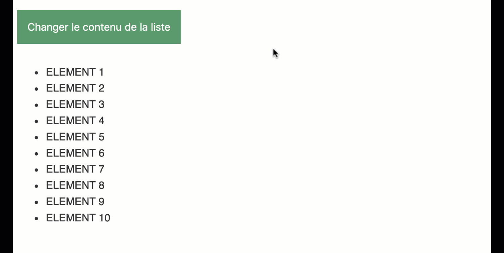
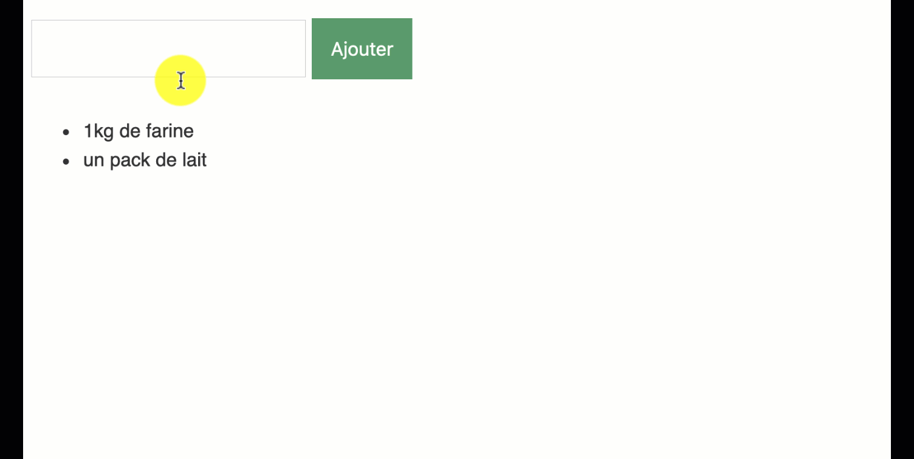
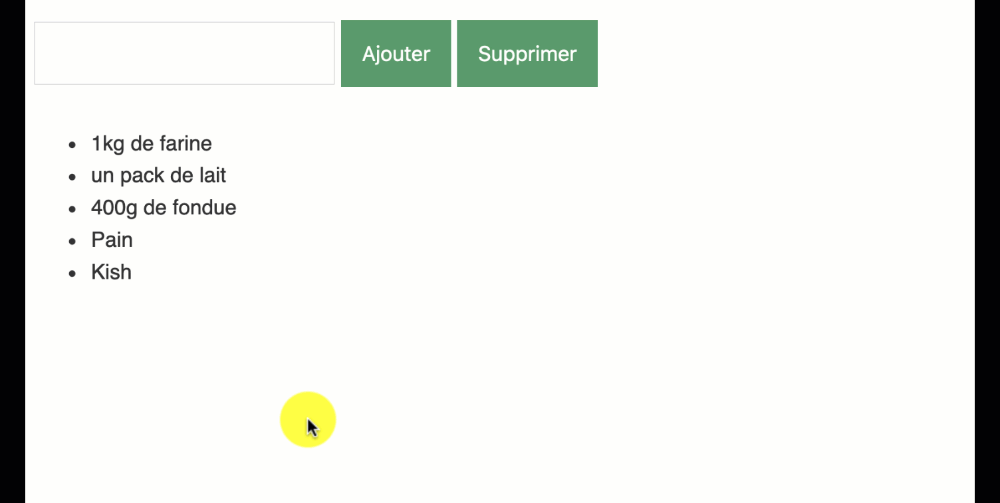

# 133A - Exercice Listes

## Partie 1 – Modifier un élément HTML

### A lire avant de commencer :

* [Accéder aux éléments](https://divtec.gitbook.io/133a/javascript/dom-introduction/dom-acceder)
* [Modifier le style CSS](https://divtec.gitbook.io/133a/javascript/dom-introduction/modifier-le-style-css)
* [Modifier les contenus textes](https://divtec.gitbook.io/133a/javascript/dom-introduction/dom-modifier-texte)
* [Gérer les événements](https://divtec.gitbook.io/133a/javascript/dom-introduction/evenements)

### Objectifs

Récupérer les fichiers `liste1.html` et `liste1.js`.

Sur click du bouton "Changer le contenu de la liste" :

1. Changer le style CSS de la liste, `list-style-type`, en carré : `square`
2. Remplacer le texte de tous les éléments de la liste par « CLICK ME **n** », n représentant la position de l'élément dans la liste : 1, 2, 3, ...
3. Affecter un évènement click à tous les éléments de la liste qui ouvrira une fenêtre d’avertissement `alert` affichant le contenu de l'élément cliqué.

### Contraintes 

* Interdiction de modifier le code du document HTML

## Partie 2 - Créer des éléments HTML

### A lire avant de commencer :

* [Créer des éléments](https://divtec.gitbook.io/133a/javascript/dom-introduction/dom-creer)

### Objectifs

Récupérer les fichiers `liste2.html` et `liste2.js`.

Sur click du bouton "Ajouter" :

1. Valider que le champ texte n'est pas vide. S'il, est vide afficher "Entrez
 un article !" dans une `alert` et terminer le script.
2. Récupérer le texte entré par l’utilisateur et l’ajouter comme nouvel élément `<li>` à la fin de la liste.
3. Vider le champ texte

### Contraintes

* Interdiction de modifier le document HTML
* Utiliser les méthodes `createElement()` et  `appendChild()` pour créer et ajouter des éléments à la liste.

## Partie 3 - Supprimer des éléments

### A lire avant de commencer :

* [Supprimer, remplacer et cloner](https://divtec.gitbook.io/133a/javascript/dom-introduction/supprimer-remplacer-et-cloner)

### Objectifs

Améliorer votre script du fichier `liste2.js`.

1. En JavaScript, ajouter un bouton "Supprimer" à la fin du paragraphe contenant le champ texte et le bouton "Ajouter".
2. Sur click du nouveau bouton "Supprimer", supprimer le dernier élément de
 la liste.
3. Ajouter un événement double click à la liste `<ul>` :
   1. Récupérer l'élément `<li>` double clické `target` dans la liste `<ul>`
   2. Supprimer l'élément `<li>` double clické

### Contraintes

* Interdiction de modifier le document HTML
* Utiliser  `cloneNode(false)` pour créer le bouton supprimer en clonant le bouton ajouter, puis en modifiant la valeur du bouton.
* Utiliser la méthode `remove()` pour supprimer des éléments
